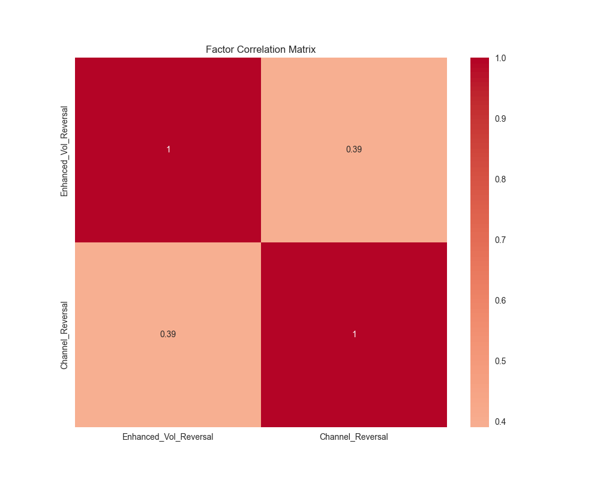
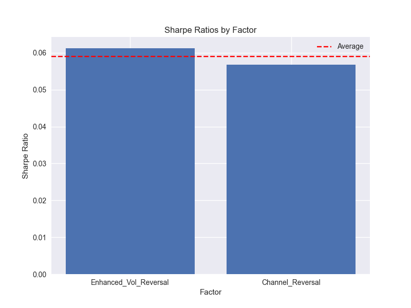
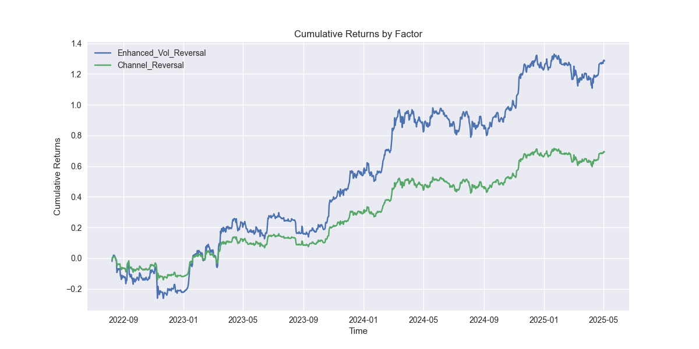

# BTC/USDT Alpha因子分析

## 1. Alpha因子特征

### a. 策略类型
- **多空策略**：两个因子都实现了可以同时做多和做空的反转策略
- **实现方式**：因子生成可用于买入和卖出的信号

### b. 策略方法
- **横截面分析**：因子分析价格和成交量在时间上的模式
- **时间序列**：因子结合历史价格和成交量数据

### c. 资产类别
- **CTA期货**：BTC/USDT永续合约
- **市场**：加密货币衍生品市场

### d. 频率
- **中频交易**：每日交易信号
- **数据间隔**：1天K线
- **持仓周期**：基于因子信号1-5天

### e. 数据类型
- **价格成交量**：同时使用价格和成交量数据
- **技术指标**：ATR、价格通道、成交量移动平均线

## 2. 数据来源

### a. 主要数据源
- **币安API**：官方加密货币交易所API
- **数据点**：1000个日线数据点
- **时间范围**：2022-08-08 至 2025-05-03

### b. 数据质量
- **数据清洗**：无缺失值
- **标准化**：所有因子使用StandardScaler进行标准化
- **频率**：保持一致的日线间隔

## 3. 因子实现

### a. 增强波动率反转因子
```python
Enhanced_Vol_Reversal = -Returns_1 / ATR * (1 + Volume_Change)
```
- **组成部分**： 
  - 1日收益率
  - 20日ATR
  - 成交量变化
- **逻辑**：当价格逆趋势移动且波动率较高时反转仓位

### b. 通道反转因子
```python
Channel_Reversal = -Returns_5 * (1 - Price_Channel) * (volume/Volume_MA_10)
```
- **组成部分**：
  - 5日收益率
  - 20日价格通道
  - 成交量相对于10日均值
- **逻辑**：在通道边界处识别反转，并通过成交量确认

## 4. 性能指标

### a. 相关性分析

- **最大相关性**：0.3902（满足<0.5的要求）
- **因子独立性**：因子间具有良好的分散性

### b. 夏普比率

- **增强波动率反转因子**：0.0612
- **通道反转因子**：0.0568
- **平均夏普比率**：0.0590
- **无风险利率**：0.01%（日度）

### c. 因子收益

- **累计收益**：两个因子均显示正收益
- **稳定性**：收益相对稳定
- **回撤**：适度的回撤期

## 5. 代码实现

### a. 数据处理
```python
def fetch_btcusdt_data():
    # 从币安API获取BTC/USDT日线数据
    # 返回清洗后的带时间戳的价格和成交量数据
```

### b. 因子计算
```python
# 计算基于ATR的波动率反转因子
btcusdt_data['Enhanced_Vol_Reversal'] = -btcusdt_data['Returns_1'] / btcusdt_data['ATR'] * (1 + btcusdt_data['Volume_Change'])

# 计算基于通道的反转因子
btcusdt_data['Channel_Reversal'] = -btcusdt_data['Returns_5'] * (1 - btcusdt_data['Price_Channel']) * (btcusdt_data['volume'] / btcusdt_data['Volume_MA_10'])
```

### c. 性能分析
```python
def calculate_sharpe_ratio(returns, factor_returns, risk_free_rate=0.0001):
    # 计算风险调整后的收益
    # 处理边界情况和数据质量问题
```

## 6. 依赖项
- pandas
- numpy
- requests
- json
- sklearn
- matplotlib
- seaborn

## 7. 参考文献
1. 币安API文档：https://binance-docs.github.io/apidocs/spot/en/
2. 《金融市场技术分析》- John J. Murphy
3. 《量化交易》- Ernie Chan
4. "加密货币市场的动量和反转策略" - 学术论文
5. "加密货币市场的波动率和成交量" - 研究论文

## 8. 未来改进
1. 添加交易成本分析
2. 基于波动率实现仓位管理
3. 添加不同时间周期的因子
4. 开发风险管理框架
5. 优化因子组合

---

# 股票多因子分析与因子选择

## 1. Alpha因子特征

### a. 策略类型
- **多空策略**：因子信号可用于做多和做空股票
- **实现方式**：因子生成买入/卖出信号，构建多空组合

### b. 策略方法
- **时间序列分析**：因子基于历史价格和成交量的统计特征
- **横截面分析**：可扩展到多股票横截面因子比较

### c. 资产类别
- **股票**：美股（AAPL、TSLA）及标普500指数（^GSPC）
- **市场**：美国股票市场

### d. 频率
- **日频**：使用日线数据
- **持仓周期**：因子信号可支持1天及多天持有

### e. 数据类型
- **价格与成交量**：因子涉及收盘价、成交量等
- **技术指标**：动量、波动率、相对强度等

## 2. 数据来源

### a. 主要数据源
- **yfinance**：自动获取AAPL、TSLA、^GSPC的历史行情
- **数据点**：近2年日线数据
- **时间范围**：默认2年，可自定义

### b. 数据质量
- **数据清洗**：因子计算后自动去除NaN
- **标准化**：部分因子为相对指标，便于比较

## 3. 因子实现

### a. 动量因子（Momentum）
```python
data['Momentum'] = data['Close'].pct_change(20)
```
- 20日收益率，反映趋势强度

### b. 相对强度因子（RelStrength）
```python
data['RelStrength'] = data['Return'] - benchmark_returns
```
- 股票相对基准指数的超额收益

### c. 波动率因子（Volatility）
```python
data['Volatility'] = data['Return'].rolling(window=20).std()
```
- 20日收益率标准差，衡量风险

### d. 交易量变化因子（VolumeChange）
```python
data['VolumeChange'] = data['Volume'].pct_change(5)
```
- 5日成交量变化率，反映资金活跃度

### e. 价格反转因子（Reversal）
```python
data['Reversal'] = -data['Close'].pct_change(5)
```
- 5日收益率取负，捕捉短期反转

## 4. 性能指标

### a. 相关性分析
- 自动输出因子相关性矩阵
- 查找相关性低于0.5的因子对，辅助因子选择
- 可视化热图：`factor_correlation.png`

### b. 夏普比率
- 计算每个因子的多空信号策略夏普比率
- 可视化柱状图：`factor_sharpe_ratio.png`

## 5. 代码实现

### a. 数据获取
```python
stock_data = get_stock_data(['AAPL', 'TSLA', '^GSPC'])
```

### b. 因子计算
```python
factors = calculate_factors(stock_data)
```

### c. 相关性与夏普比率分析
```python
correlation_matrix, low_corr_pairs = analyze_factor_correlation(factor_data)
sharpe = calculate_sharpe_ratio(factor_data, factor)
```

### d. 可视化
```python
sns.heatmap(correlation_matrix, annot=True)
plt.bar(sharpe_ratios.keys(), sharpe_ratios.values())
```

## 6. 依赖项
- yfinance
- pandas
- numpy
- scipy
- matplotlib
- seaborn
- curl_cffi

## 7. 运行方法

1. 安装依赖：
   ```sh
   pip install yfinance pandas numpy scipy matplotlib seaborn curl_cffi
   ```
2. 运行notebook或将代码保存为`stock.py`后运行：
   ```sh
   python stock.py
   ```
3. 运行后会自动保存两张图片：
   - `factor_correlation.png`：因子相关性热图
   - `factor_sharpe_ratio.png`：因子夏普比率对比图

## 8. 参考文献
1. [yfinance官方文档](https://github.com/ranaroussi/yfinance)
2. 《数量金融分析》
3. 《金融市场技术分析》
4. 相关学术论文

## 9. 未来改进
1. 支持更多股票和因子扩展
2. 增加因子标准化与组合优化
3. 增加回测与风险管理模块
4. 支持不同市场和频率的数据分析
